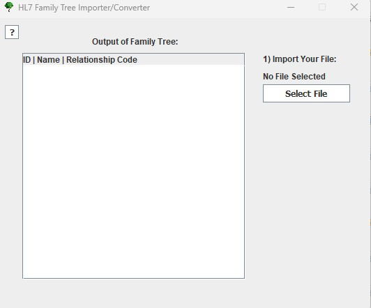
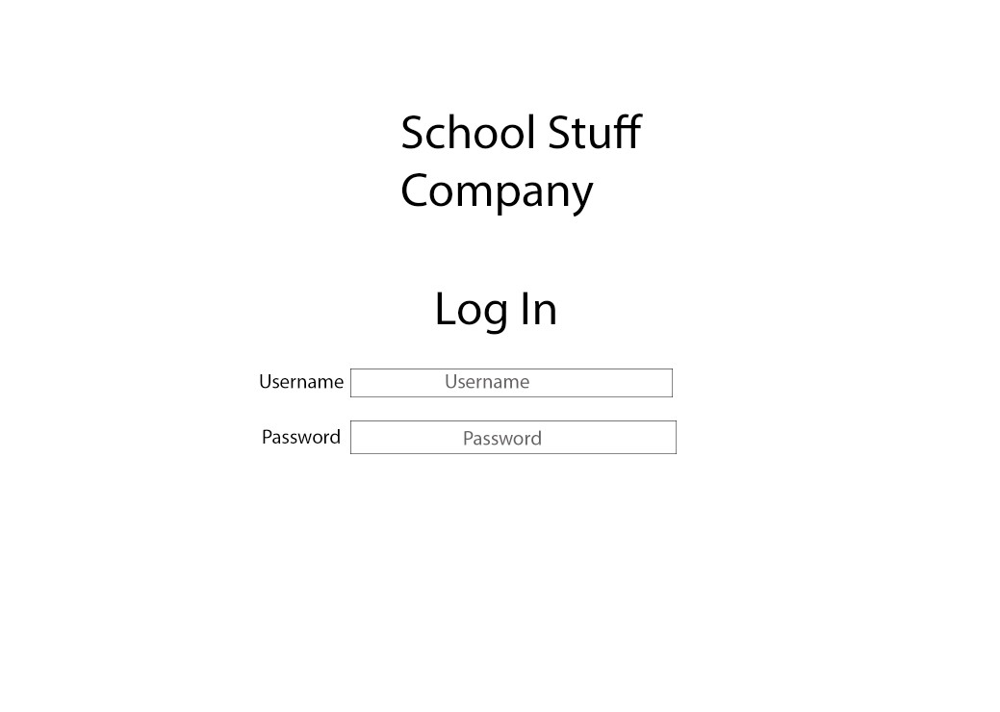
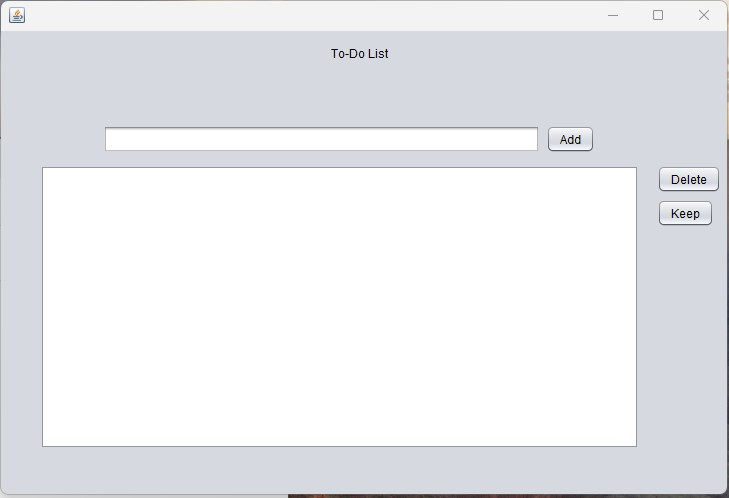

Portfolio
=========

Programming Projects
--------------------

*For access to my private project repositories, please [email me](mailto:Echack@csustudent.net?subject=GitHub%20Access) with the subject line, GitHub Access.

---
### [HL7 Family Tree Converter | CSCI 49541M](project1.md)

---
### [Inventory Locator | CSCI 41490](project2.md)

---
### [Online Store | CSCI 33201](project3.md)

---
### [To-do list | CSCI 32501](project4.md)

Ethics Papers
-------------

### [App Idea](pdf/Ethics_Paper_1.pdf)

-   **Class: Programming In Alice**  
-   **Grade: 93**

### [Dilemmas In My Chosen Field](pdf/Object_Oriented_Ethics_Paper_2.pdf)

-   **Class: Object Oriented Programming** 
-   **Grade: 95**

### [Everybody Should Know About Cyber Security](pdf/Paper_2.pdf)

-   **Class:English Composition/Rhetoric** 
-   **Grade:97**

---

Presentations
-------------

### [Sony Hack](pdf/Sony_hack.pdf)

- **Class: Cyber Defense** 
- **Grade: 98**

### [Buffer-Overflow Attack and Heap-based buffer overflow attack](pdf/Buffer-Overflow_Attack_and_Heap-based_buffer_overflow_attack.pdf)

- **Class: Cyber Defense** 
- **Grade: 100**

---

Page template forked from <a href="https://github.com/csu-cs/csci-portfolio">CSU-CS</a>

<!-- Remove above link if you don't want to attributive -->
