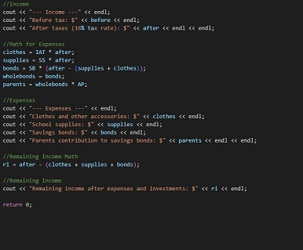

[Back to Portfolio](./)

HL7 Family Tree Converter
===============

-   **Class: System Analysis and Software Design** 
-   **Grade:90** 
-   **Language(s): Java** 
-   **Source Code Repository:none**

## Project description

The proposed program aims to develop a sophisticated tool with the primary objective of reading XML/HL7 files containing patient data provided. The tool will generate a visual list of the patient family tree allowing the user to explore and select different family members. The main focus of this system is to empower users to dynamically reorient the list based on the chosen family member they would like to know about. This will ensure that the identified family member becomes the main center point with the correct assigned ID. The user can then export the file and see the results they want to know that will be located in the file created.

## How to run the program

The project can be runned by downloading it into any file and by clicking on it it should open. As long as the recent version of java is installed then the program will open. To actually use the features of the program, you must have a properly formatted XML/HL7 files ready to be used.

## UI Design

The user will import an XML/HL7 file that will give a list of family members and each member will be given a label to go along with their standing in the family.

  

Fig 1. and Fig 2. show what the UI of the program looks like

## 3. Additional Considerations

After working on this project with my group/team we came to the conclusion that to improve it we could create a better UI that is more pleasing to look at for users.

[Back to Portfolio](./)
