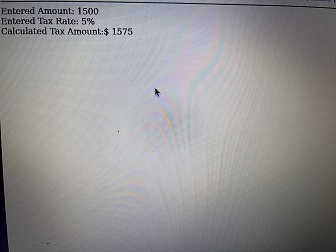
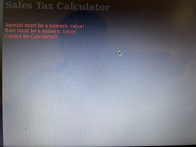

[Back to Portfolio](./)

Inventory Locator
===============

-   **Class: Database Management** 
-   **Grade:94** 
-   **Language(s): none** 
-   **Source Code Repository:none**

## Project description

This projects code allows the user to track what items have been taken out of the main inventory and what items are needed to replenish inventory. It will also give certain users access to transaction data made from purchases.

## How to run the program

To run the program you would open it up in oracle apex withint a workplace.

## UI Design

When ran there will be a home menue with company information and a box on the top left that when clicked will allow users to select what they are searching for in terms of inventory. Like transaction history and inventory control.

  
Fig 1. The launch screen

  
Fig 2. Example output after input is processed.

  
Fig 3. Feedback when an error occurs.

## 3. Additional Considerations

Addition considerations I would make is that I would like to make the UI more pleasing to look at and I would like to add more options for managing inventory. Like where certain inventory will be shipped to and if certain packaging is required in order to ship said inventory.
[Back to Portfolio](./)
