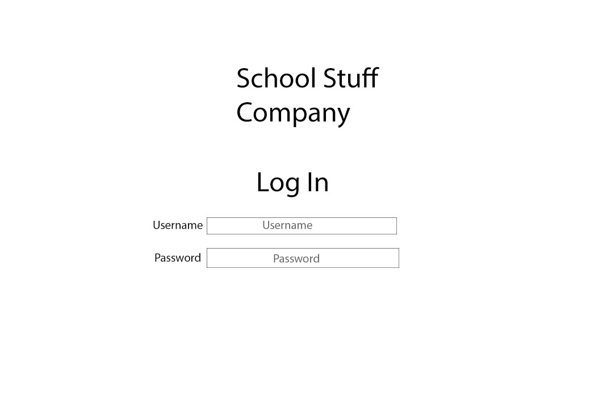
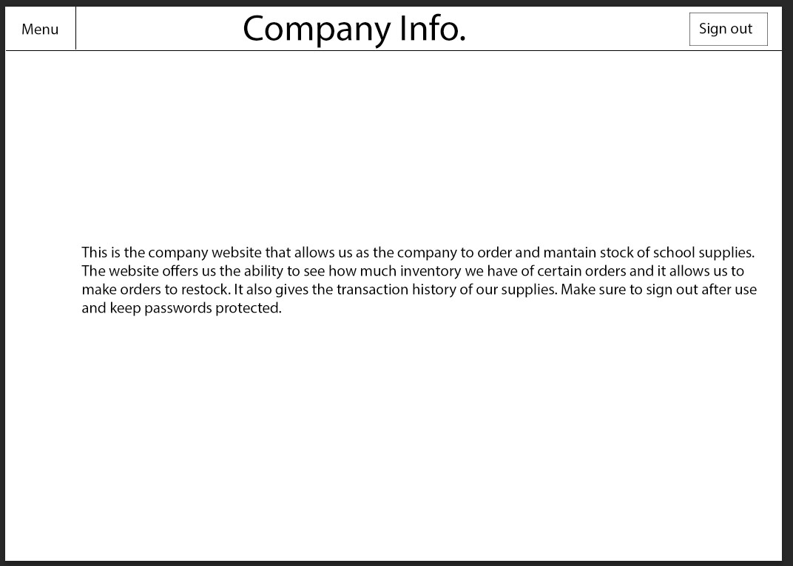
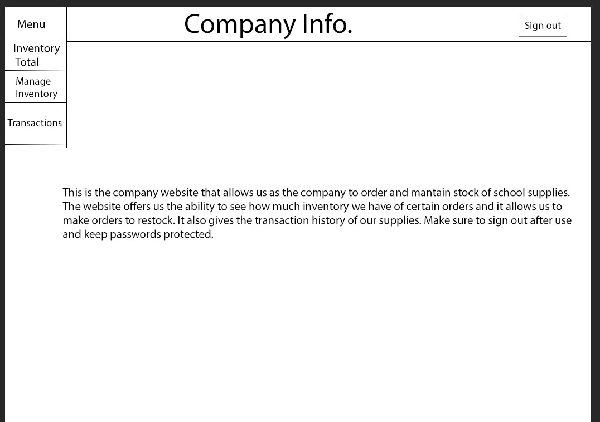
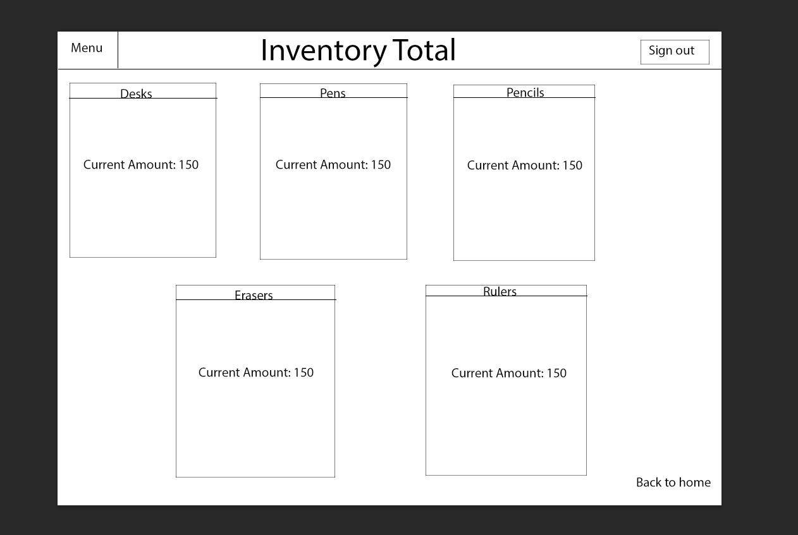
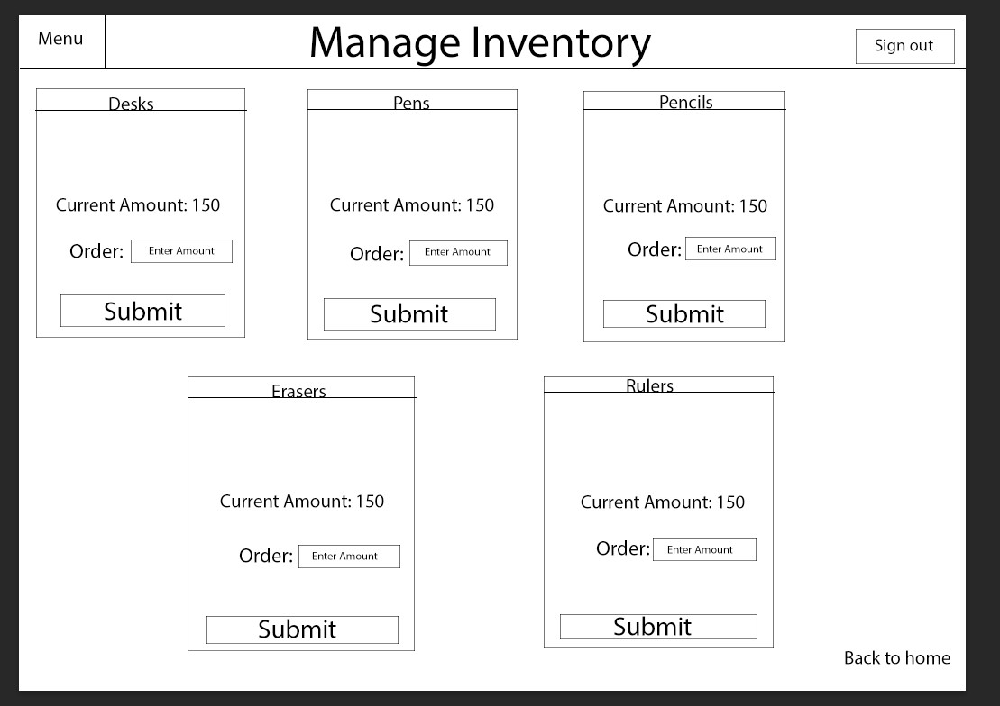
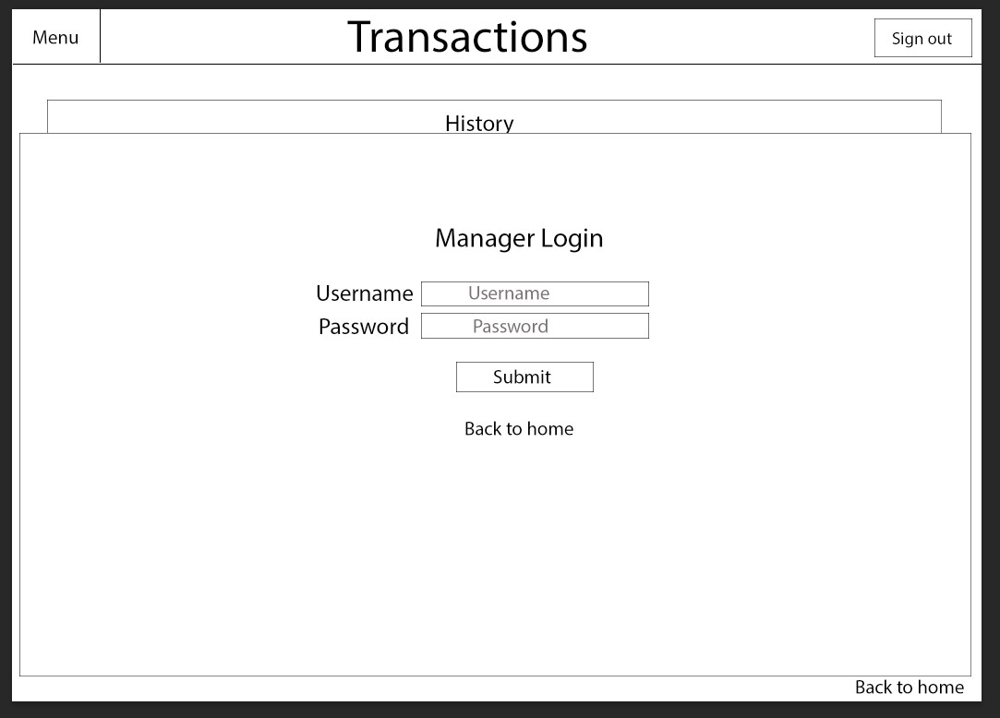
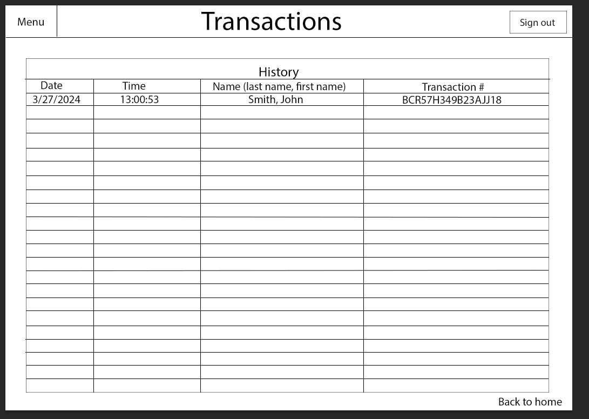

[Back to Portfolio](./)

Inventory Locator
===============

-   **Class: Database Management** 
-   **Grade:94** 
-   **Language(s): none** 
-   **Source Code Repository:none**

## Project description

This projects code allows the user to track what items have been taken out of the main inventory and what items are needed to replenish inventory. It will also give certain users access to transaction data made from purchases.

++ Important: The website used to create the project experienced technicall difficulties and I was not able to recover the project, but I attained a grade for the overall project. ++

## How to run the program

To run the program you would open it up in oracle apex withint a workplace.

## UI Design

When ran there will be a home menu with company information and a box on the top left that when clicked will allow users to select what they are searching for in terms of inventory. Like transaction history and inventory management.

  
Fig 1. The login screen

  
Fig 2. The home menu that tell employees what the website is used for and what to do.

  
Fig 3. This shows what the menu on the top left when clicked will show.

  
Fig 4. This shows what the Inventory total looks like in terms of each item.

  
Fig 5. The Manage Inventory option shows what the total current items are and gives users the option to purchase more of any type of item.

  
Fig 6. This screen will pop up when trying to look at the companies transaction history. Only the manager is allowed to look at this information because it is private information given by consumers.

  
Fig 7. This is the transaction history page, it shows what transactions have taken place and when they took place.

## 3. Additional Considerations

Addition considerations I would make is that I would like to make the UI more pleasing to look at and I would like to add more options for managing inventory. Like where certain inventory will be shipped to and if certain packaging is required in order to ship said inventory.
[Back to Portfolio](./)
