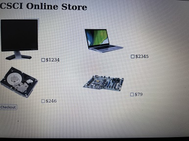

[Back to Portfolio](./)

Online Store
===============

-   **Class: Computer Architecture** 
-   **Grade:None** 
-   **Language(s): none** 
-   **Source Code Repository:none**

## Project description

The user can select four options of what they want to buy. After selecting the items and pressing submit, they will go to another page that will show them the total of their selection.

## How to run the program

The project can be runned by downloading it into any program that can run php. I used Visual studio code for the project and to run it I connected it to the php server and would run it there.

## UI Design

The user will choose options given to them. When clicking the submit button they will be taken to another page that will show the total of their selection and it will be put into a table for them to view.

  
Fig 1. The launch screen

  
Fig 2. Example output after input is processed.

## 3. Additional Considerations

More things I could consider when doing this project is add an error screen to the project so that if nothing is chosen an error will occur. I could also add more items to the available options in order to add more variety to the project. I could also add a checkout system that will allow users to simulate what it would be like to order from a real website.

[Back to Portfolio](./)
