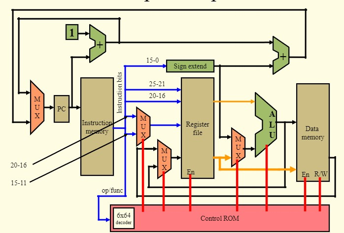

[Back to Portfolio](./)

Single Cycle Processor (SCP)
===============

-   **Class: Computer Architecture** 
-   **Grade:90** 
-   **Language(s): verilog** 
-   **Source Code Repository:** [Single Cycle Processor Repository](https://github.com/Echack/Single-Cycle-Processor)

## Project description

The projects goal is for the SCP to simulate the execution of the loop example given in the code byloading and running the machine code.

## How to run the program
To compile and run: iverilog/*.v && ./a.out

## UI Design

 
Fig 1. This is the datapath that the SCP will follow when running.

 
Fig 1. This is what the result of the datapath looks like.
## 3. Additional Considerations
The one consideration I have is that I would like to make it easier to understand by creating a better display that shows the interconnection between components.

[Back to Portfolio](./)
