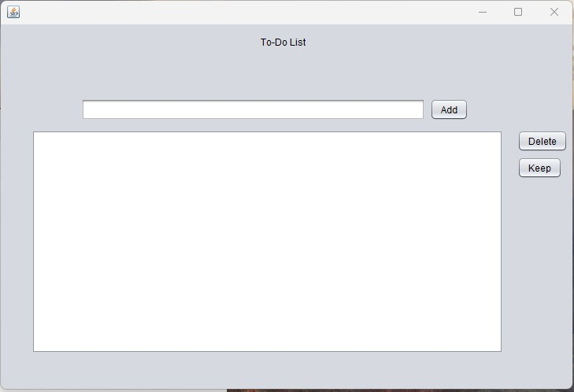

[Back to Portfolio](./)

To-Do List
===============

-   **Class: Object Oriented** 
-   **Grade:93** 
-   **Language(s): C++** 
-   **Source Code Repository:none**

## Project description

It is a to-do list that a user can add tasks and remove tasks from.

## How to run the program

The project can be runned by downloading it into any program that can run c++. In my project I used the "run" button in Apache Netbeans.

## UI Design

The User will type whatever task they want into the bar and when they click the enter button the task will be added to the list. There is also a delete button that will remove the desired task of the user.

  

Fig 1. The code used in the project and the code runs in Apache Netbeans.

## 3. Additional Considerations

After making this project, I could develop a better interface that is more pleasing to look at and I could add more features that users could use to help label the importance of tasks. I could also create a calender system that could show what tasks are due on certain days based on the users input.

[Back to Portfolio](./)
